# Nakama API Architecture

This document details the API architecture of Nakama, covering HTTP/REST, gRPC, and WebSocket APIs.

## API Layer Overview

Nakama exposes three primary API interfaces:

1. **HTTP/REST API** - RESTful endpoints for standard operations
2. **gRPC API** - High-performance binary protocol
3. **WebSocket API** - Real-time bidirectional communication

## API Architecture

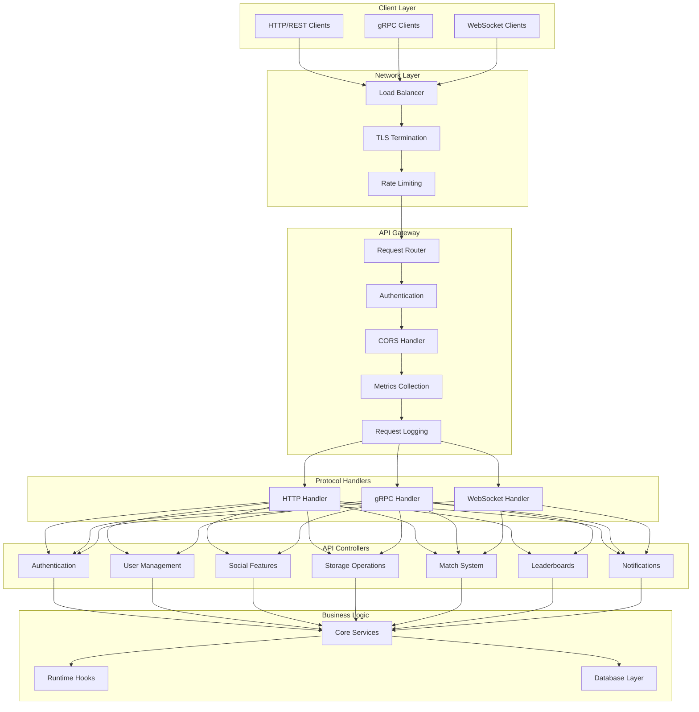

## HTTP/REST API Flow

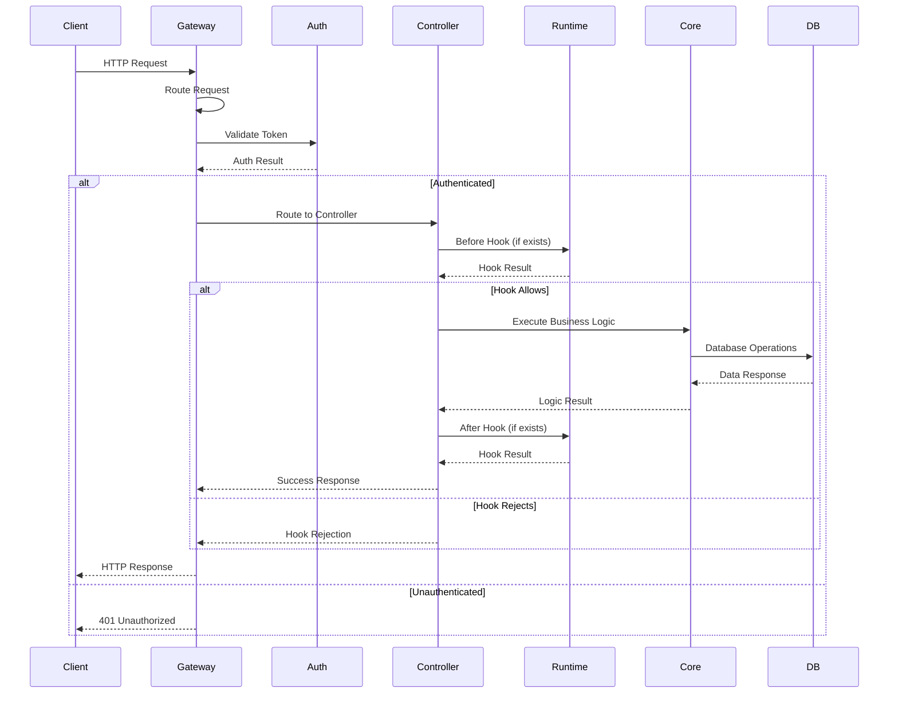

## gRPC API Flow

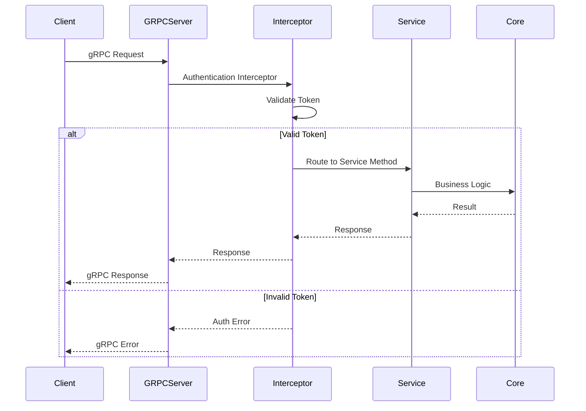

## WebSocket API Flow

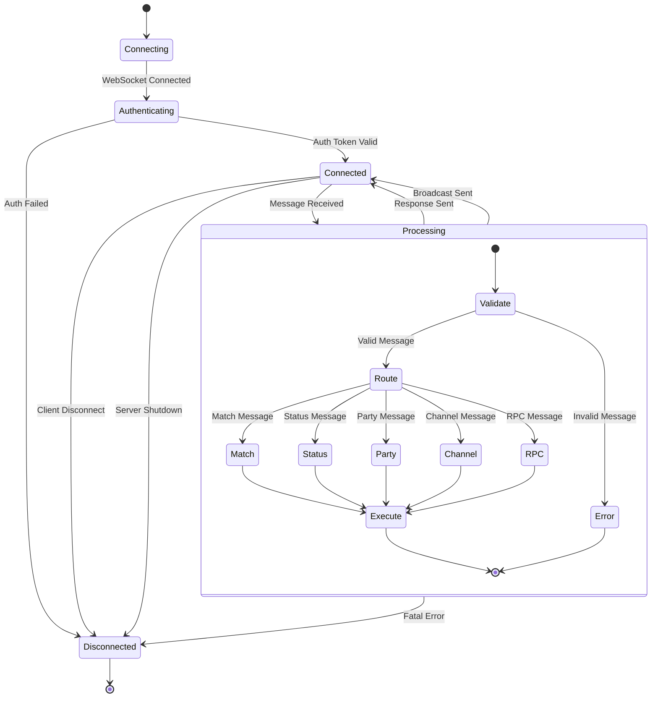

## API Endpoints Structure

### HTTP/REST Endpoints

```mermaid
graph TB
    subgraph "Authentication"
        AuthDevice[POST /v2/account/authenticate/device]
        AuthEmail[POST /v2/account/authenticate/email]
        AuthFacebook[POST /v2/account/authenticate/facebook]
        AuthGoogle[POST /v2/account/authenticate/google]
        AuthSteam[POST /v2/account/authenticate/steam]
        AuthCustom[POST /v2/account/authenticate/custom]
    end

    subgraph "Account Management"
        GetAccount[GET /v2/account]
        UpdateAccount[PUT /v2/account]
        DeleteAccount[DELETE /v2/account]
        LinkDevice[POST /v2/account/link/device]
        UnlinkDevice[POST /v2/account/unlink/device]
    end

    subgraph "Social Features"
        GetFriends[GET /v2/friend]
        AddFriend[POST /v2/friend]
        DeleteFriend[DELETE /v2/friend/{id}]
        BlockFriend[POST /v2/friend/{id}/block]
        GetGroups[GET /v2/group]
        CreateGroup[POST /v2/group]
        JoinGroup[POST /v2/group/{id}/join]
        LeaveGroup[POST /v2/group/{id}/leave]
    end

    subgraph "Storage"
        ReadStorage[POST /v2/storage]
        WriteStorage[PUT /v2/storage]
        DeleteStorage[DELETE /v2/storage]
        ListStorage[GET /v2/storage]
    end

    subgraph "Leaderboards"
        GetLeaderboard[GET /v2/leaderboard/{id}]
        WriteLeaderboard[POST /v2/leaderboard/{id}]
        DeleteLeaderboard[DELETE /v2/leaderboard/{id}]
        ListLeaderboards[GET /v2/leaderboard]
    end

    subgraph "Real-time"
        WSEndpoint[WS /ws]
    end
```

### gRPC Services

```mermaid
graph TB
    subgraph "Nakama Service"
        AuthenticateDevice[AuthenticateDevice]
        AuthenticateEmail[AuthenticateEmail]
        AuthenticateFacebook[AuthenticateFacebook]
        AuthenticateGoogle[AuthenticateGoogle]
        AuthenticateSteam[AuthenticateSteam]
        AuthenticateCustom[AuthenticateCustom]
        GetAccount[GetAccount]
        UpdateAccount[UpdateAccount]
        GetUsers[GetUsers]
        AddFriends[AddFriends]
        DeleteFriends[DeleteFriends]
        BlockFriends[BlockFriends]
        ImportFacebookFriends[ImportFacebookFriends]
        CreateGroup[CreateGroup]
        UpdateGroup[UpdateGroup]
        DeleteGroup[DeleteGroup]
        JoinGroup[JoinGroup]
        LeaveGroup[LeaveGroup]
        AddGroupUsers[AddGroupUsers]
        BanGroupUsers[BanGroupUsers]
        KickGroupUsers[KickGroupUsers]
        PromoteGroupUsers[PromoteGroupUsers]
        DemoteGroupUsers[DemoteGroupUsers]
        ListGroupUsers[ListGroupUsers]
        ReadStorageObjects[ReadStorageObjects]
        WriteStorageObjects[WriteStorageObjects]
        DeleteStorageObjects[DeleteStorageObjects]
        RpcFunc[RpcFunc]
    end
```

### WebSocket Messages

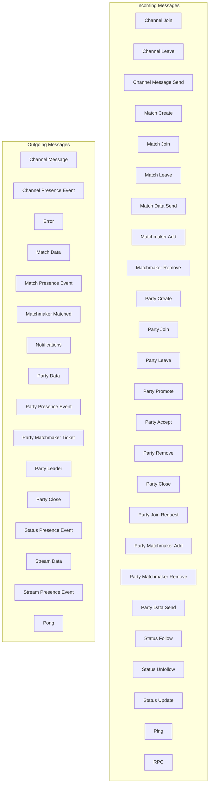

## Request/Response Patterns

### Authentication Flow

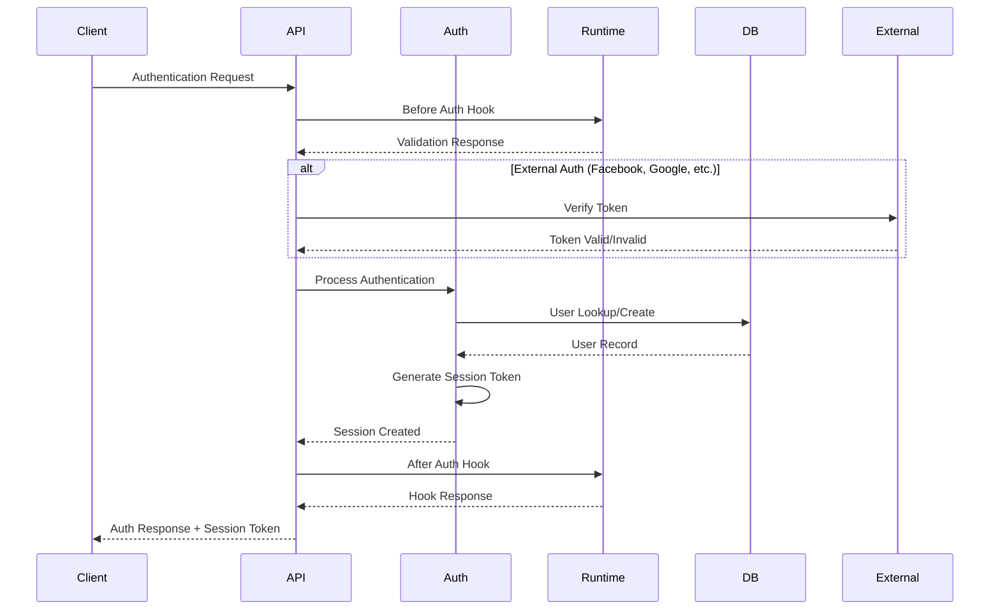

### Storage Operation Flow

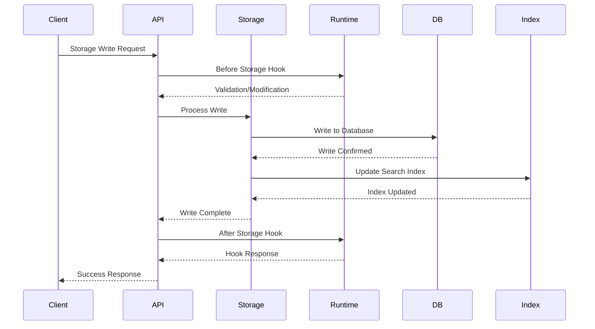

## Error Handling

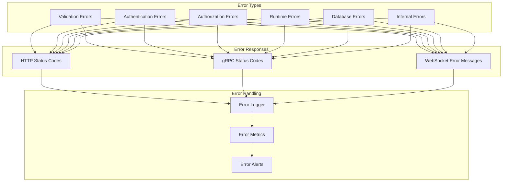

## Rate Limiting

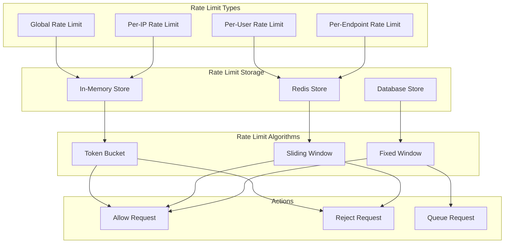

## API Security

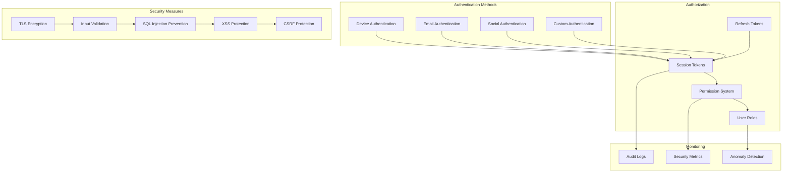

## Performance Optimization

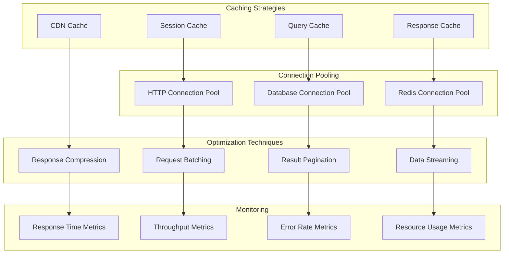

This API architecture provides a robust, scalable, and secure foundation for game and application backends, supporting multiple protocols and extensive customization through the runtime system.