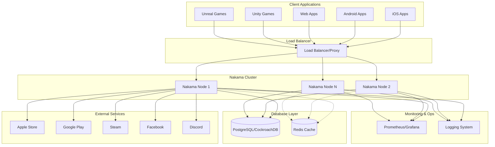
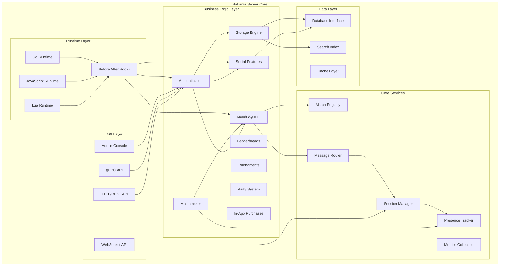
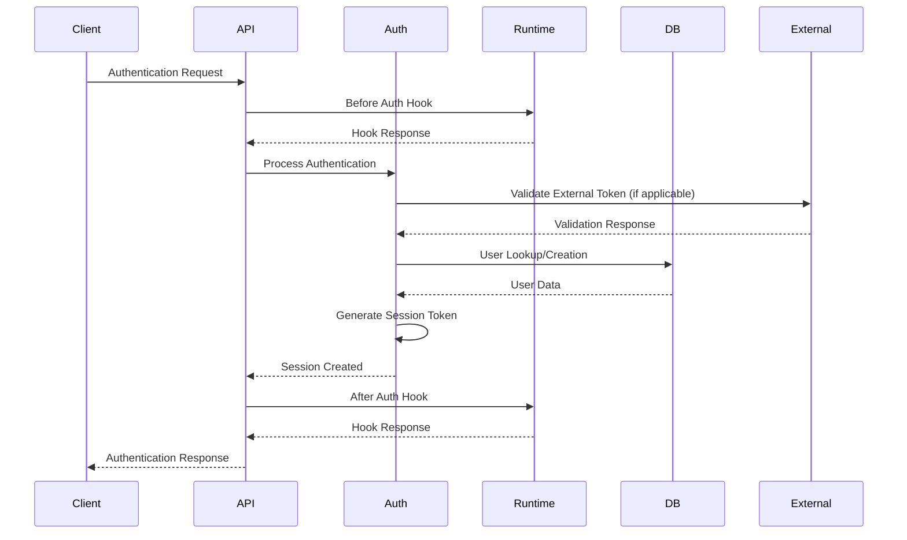
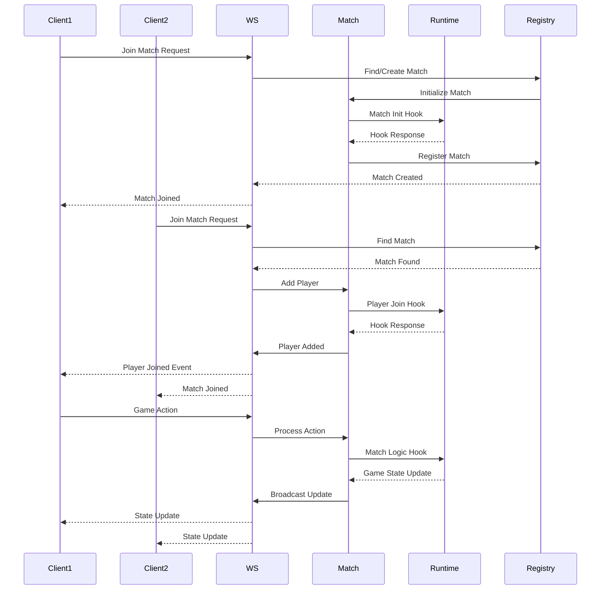
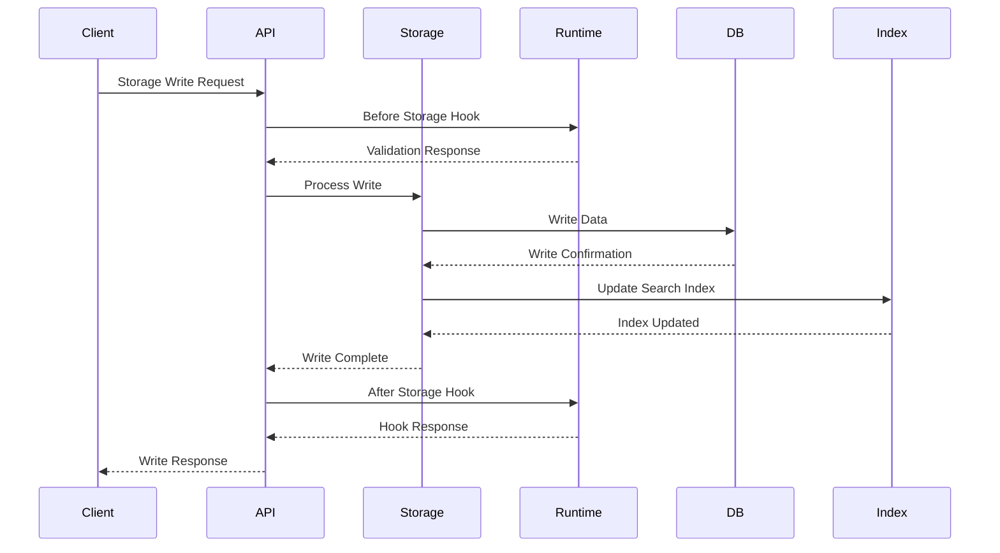
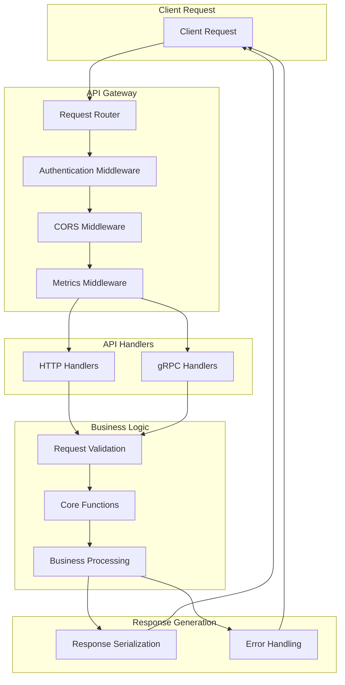
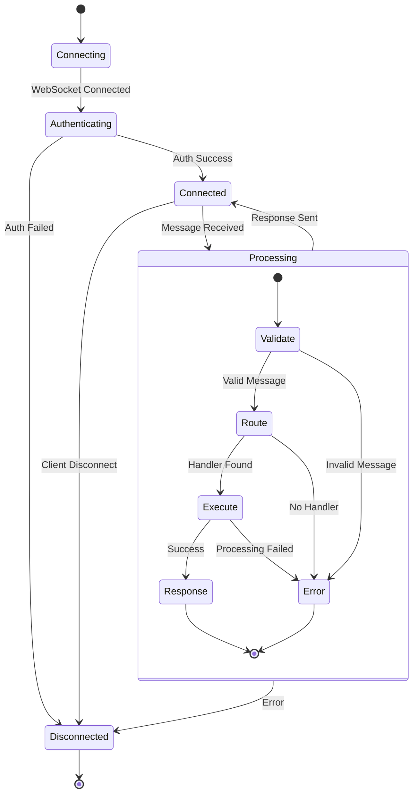
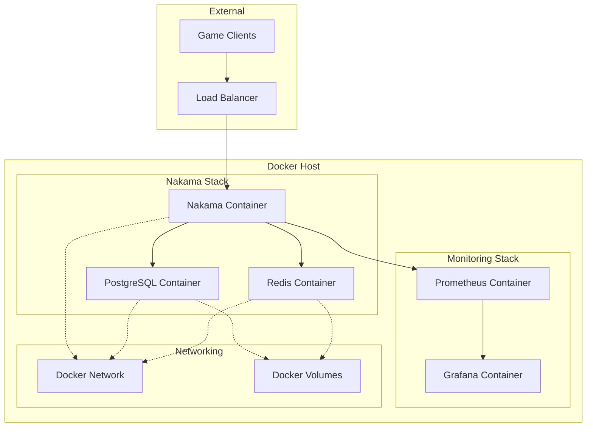
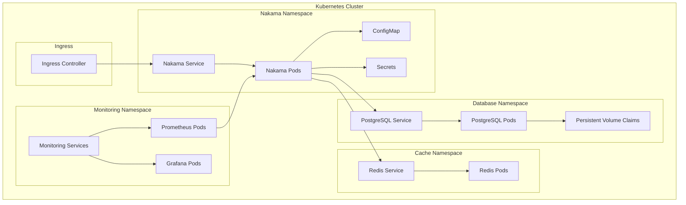
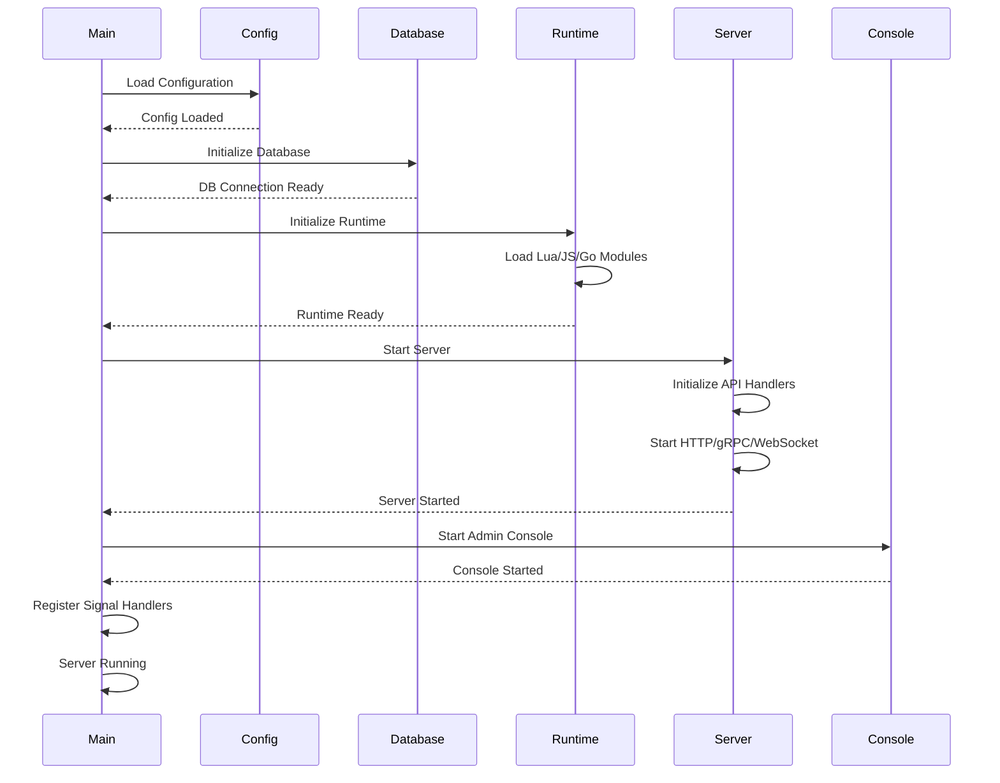

# Nakama Technical Architecture Documentation

This document provides a comprehensive overview of the Nakama game server architecture, including detailed diagrams and explanations of system components, data flows, and deployment patterns.

## Table of Contents

1. [System Overview](#system-overview)
2. [High-Level Architecture](#high-level-architecture)
3. [Component Architecture](#component-architecture)
4. [Data Flow Diagrams](#data-flow-diagrams)
5. [Runtime and Plugin Architecture](#runtime-and-plugin-architecture)
6. [API Architecture](#api-architecture)
7. [Database Architecture](#database-architecture)
8. [Deployment Architecture](#deployment-architecture)
9. [Configuration Management](#configuration-management)

## Additional Documentation

For more detailed information on specific architectural aspects:

- **[🗃️ Database Architecture](DATABASE_ARCHITECTURE.md)** - Detailed database schema, data models, and performance optimization
- **[⚙️ Runtime Architecture](RUNTIME_ARCHITECTURE.md)** - Plugin system and runtime extensibility
- **[🔌 API Architecture](API_ARCHITECTURE.md)** - HTTP/gRPC/WebSocket API details
- **[🚀 Deployment Architecture](DEPLOYMENT_ARCHITECTURE.md)** - Production deployment patterns

## System Overview

Nakama is a distributed server for social and realtime games and apps. It provides a comprehensive backend infrastructure for modern game development, including user management, social features, real-time communication, and extensible runtime capabilities.

### Key Features
- User authentication and management
- Social features (friends, groups, chat)
- Real-time and turn-based multiplayer
- Leaderboards and tournaments
- In-app purchase validation
- Extensible runtime with Lua, JavaScript, and Go support
- RESTful HTTP and gRPC APIs
- Admin console for management

## High-Level Architecture



## Component Architecture



## Data Flow Diagrams

### User Authentication Flow



### Real-time Match Flow



### Storage Operation Flow



## Runtime and Plugin Architecture

```mermaid
graph TB
    subgraph "Runtime Environment"
        subgraph "Lua Runtime"
            LuaVM[Lua VM]
            LuaModules[Lua Modules]
        end

        subgraph "JavaScript Runtime"
            V8[V8 Engine]
            JSModules[JS Modules]
        end

        subgraph "Go Runtime"
            GoPlugins[Go Plugins (.so)]
            GoModules[Go Modules]
        end
    end

    subgraph "Hook System"
        BeforeHooks[Before Hooks]
        AfterHooks[After Hooks]
        RPCHooks[RPC Functions]
        MatchHooks[Match Handlers]
        EventHooks[Event Handlers]
    end

    subgraph "Core Server"
        API[API Layer]
        Business[Business Logic]
        Database[Database]
    end

    LuaVM --> BeforeHooks
    V8 --> BeforeHooks
    GoPlugins --> BeforeHooks

    LuaVM --> AfterHooks
    V8 --> AfterHooks
    GoPlugins --> AfterHooks

    LuaVM --> RPCHooks
    V8 --> RPCHooks
    GoPlugins --> RPCHooks

    LuaVM --> MatchHooks
    V8 --> MatchHooks
    GoPlugins --> MatchHooks

    BeforeHooks --> API
    AfterHooks --> API
    RPCHooks --> API
    MatchHooks --> Business
    EventHooks --> Business

    API --> Business
    Business --> Database

    LuaModules --> LuaVM
    JSModules --> V8
    GoModules --> GoPlugins
```

## API Architecture

### HTTP/gRPC Request Flow



### WebSocket Connection Flow



## Database Architecture

```mermaid
erDiagram
    users ||--o{ user_device : has
    users ||--o{ user_edge : from
    users ||--o{ user_edge : to
    users ||--o{ storage : owns
    users ||--o{ leaderboard_record : has
    users ||--o{ tournament_record : has
    users ||--o{ groups : member_of
    users ||--o{ message : sends
    users ||--o{ notification : receives
    users ||--o{ wallet_ledger : has

    groups ||--o{ group_edge : from
    groups ||--o{ group_edge : to

    leaderboard ||--o{ leaderboard_record : contains
    tournament ||--o{ tournament_record : contains

    users {
        uuid id PK
        string username
        string display_name
        string avatar_url
        string lang_tag
        string location
        string timezone
        jsonb metadata
        timestamp create_time
        timestamp update_time
    }

    user_device {
        uuid id PK
        uuid user_id FK
        string platform
        string identifier
        jsonb vars
    }

    storage {
        string collection
        string key
        uuid user_id FK
        string value
        string version
        jsonb read
        jsonb write
        timestamp create_time
        timestamp update_time
    }

    leaderboard {
        string id PK
        jsonb metadata
        timestamp create_time
        string operator
        bool reset_schedule_active
    }

    groups {
        uuid id PK
        uuid creator_id FK
        string name
        string description
        string avatar_url
        string lang_tag
        jsonb metadata
        bool open
        int edge_count
        int max_count
        timestamp create_time
        timestamp update_time
    }
```

## Deployment Architecture

### Docker Deployment



### Kubernetes Deployment



## Configuration Management

```mermaid
graph TB
    subgraph "Configuration Sources"
        ConfigFile[nakama.yml]
        EnvVars[Environment Variables]
        CLIFlags[Command Line Flags]
        RuntimeConfig[Runtime Configuration]
    end

    subgraph "Configuration Processing"
        Parser[Config Parser]
        Validator[Config Validator]
        Merger[Config Merger]
    end

    subgraph "Server Components"
        Database[Database Config]
        Runtime[Runtime Config]
        Socket[Socket Config]
        Session[Session Config]
        Social[Social Config]
        Metrics[Metrics Config]
        Logger[Logger Config]
    end

    ConfigFile --> Parser
    EnvVars --> Parser
    CLIFlags --> Parser
    RuntimeConfig --> Parser

    Parser --> Validator
    Validator --> Merger
    Merger --> Database
    Merger --> Runtime
    Merger --> Socket
    Merger --> Session
    Merger --> Social
    Merger --> Metrics
    Merger --> Logger

    note: "Configuration precedence: CLI Flags > Environment Variables > Configuration File > Defaults"
```

### Server Startup Flow



## Conclusion

This architecture documentation provides a comprehensive overview of the Nakama game server's technical design. The modular architecture allows for:

- **Scalability**: Horizontal scaling through multiple server instances
- **Extensibility**: Plugin system supporting multiple runtime languages
- **Reliability**: Robust error handling and monitoring capabilities
- **Maintainability**: Clear separation of concerns between components
- **Performance**: Efficient data flow and caching strategies

For more detailed information about specific components, refer to the source code and inline documentation in the respective modules.