# Nakama Database Architecture and Data Model

This document details the database architecture, schema design, and data relationships in Nakama.

## Database Architecture Overview

Nakama uses PostgreSQL (or PostgreSQL-compatible databases like CockroachDB) as its primary data store, with Redis for caching and session management.

## Core Data Model

```mermaid
erDiagram
    users ||--o{ user_device : has
    users ||--o{ user_edge : from_user
    users ||--o{ user_edge : to_user
    users ||--o{ storage : user_id
    users ||--o{ message : sender_id
    users ||--o{ notification : user_id
    users ||--o{ wallet_ledger : user_id
    users ||--o{ leaderboard_record : owner_id
    users ||--o{ tournament_record : owner_id
    users ||--o{ group_edge : user_id

    groups ||--o{ group_edge : group_id
    groups ||--o{ message : group_id

    leaderboard ||--o{ leaderboard_record : leaderboard_id
    tournament ||--o{ tournament_record : tournament_id

    users {
        uuid id PK
        string username
        string display_name
        string avatar_url
        string lang_tag
        string location
        string timezone
        jsonb metadata
        timestamp create_time
        timestamp update_time
        timestamp last_online_at
        boolean online
        boolean edge_count
        boolean disable_time
    }

    user_device {
        string id PK
        uuid user_id FK
        timestamp create_time
        timestamp update_time
        jsonb vars
    }

    user_edge {
        uuid source_id FK
        uuid destination_id FK
        timestamp create_time
        timestamp update_time
        int state
        string label
    }

    storage {
        string collection
        string key
        uuid user_id FK
        string value
        string version
        int permissionRead
        int permissionWrite
        timestamp create_time
        timestamp update_time
    }

    groups {
        uuid id PK
        uuid creator_id FK
        string name
        string description
        string avatar_url
        string lang_tag
        jsonb metadata
        boolean open
        int edge_count
        int max_count
        timestamp create_time
        timestamp update_time
        boolean disable_time
    }

    group_edge {
        uuid source_id FK
        uuid destination_id FK
        int state
        timestamp create_time
        timestamp update_time
    }

    leaderboard {
        string id PK
        boolean authoritative
        string sort_order
        string operator
        boolean reset_schedule_active
        jsonb metadata
        timestamp create_time
        string reset_schedule
        timestamp next_reset
        string title
        string description
        string category
        timestamp start_time
        timestamp end_time
        int duration
        int max_size
        int max_num_score
        boolean join_required
    }

    leaderboard_record {
        string leaderboard_id FK
        uuid owner_id FK
        string username
        int64 score
        int64 subscore
        int num_score
        jsonb metadata
        timestamp create_time
        timestamp update_time
        timestamp expiry_time
        int rank_value
    }

    tournament {
        string id PK
        string sort_order
        string operator
        string duration
        boolean reset_schedule_active
        jsonb metadata
        timestamp create_time
        string reset_schedule
        timestamp next_reset
        string title
        string description
        string category
        timestamp start_time
        timestamp end_time
        int max_size
        int max_num_score
        boolean join_required
    }

    tournament_record {
        string tournament_id FK
        uuid owner_id FK
        string username
        int64 score
        int64 subscore
        int num_score
        jsonb metadata
        timestamp create_time
        timestamp update_time
        timestamp expiry_time
        int rank_value
    }

    message {
        uuid id PK
        string code
        uuid sender_id FK
        string username
        uuid stream_mode
        string stream_subject
        string stream_descriptor
        string stream_label
        timestamp create_time
        timestamp update_time
        boolean persistent
        jsonb content
    }

    notification {
        uuid id PK
        uuid user_id FK
        string subject
        jsonb content
        int code
        uuid sender_id
        timestamp create_time
        boolean persistent
    }

    wallet_ledger {
        uuid id PK
        uuid user_id FK
        int64 changeset
        jsonb metadata
        timestamp create_time
        timestamp update_time
    }
```

## Storage System Architecture

## User Management Schema

## Social Features Schema

## Leaderboard and Tournament Schema

## Data Access Patterns

### Read Patterns

### Write Patterns

## Database Indexing Strategy

## Data Partitioning Strategy

## Backup and Recovery

## Performance Optimization

## Data Migration Patterns

This database architecture provides a robust foundation for scalable game and application backends, with careful attention to performance, consistency, and reliability requirements.