# Nakama Deployment Architecture

This document outlines various deployment patterns and infrastructure setups for Nakama in production environments.

## Deployment Overview

Nakama supports multiple deployment strategies from single-node setups to large-scale distributed deployments across cloud providers.

## Single Node Deployment

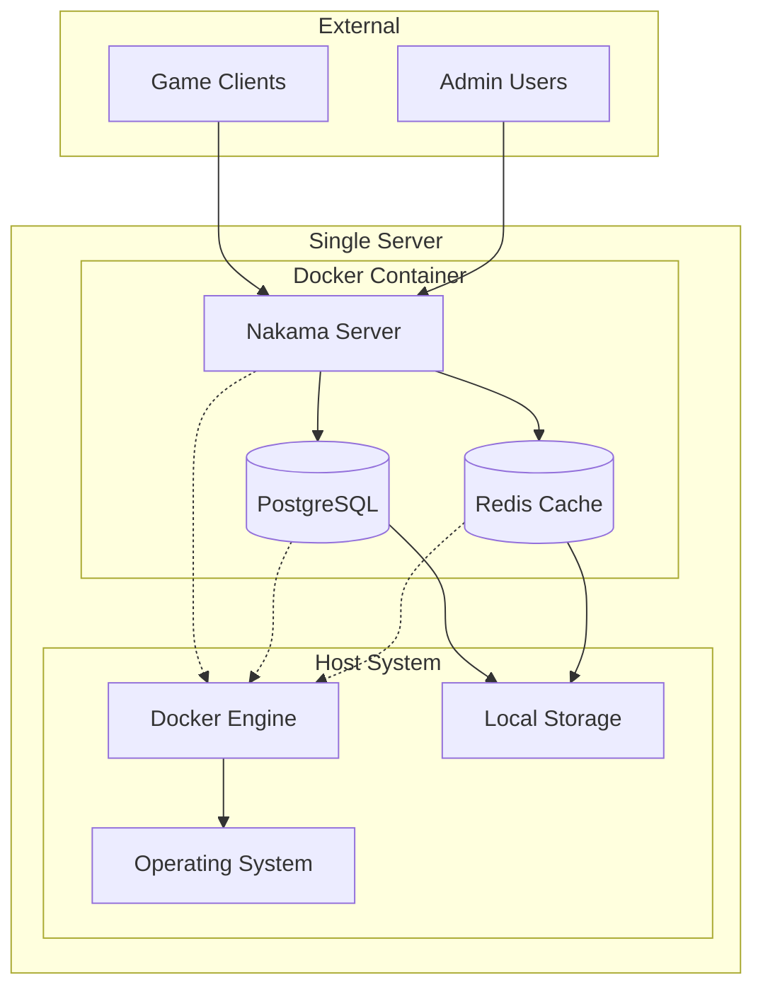

## Multi-Node Cluster Deployment

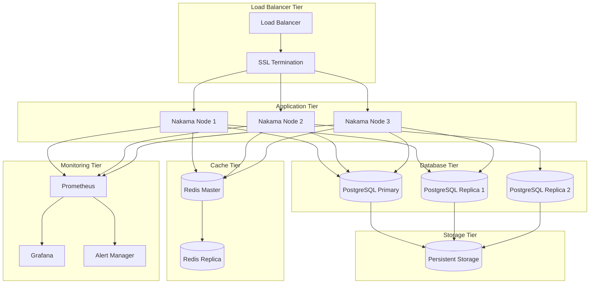

## Docker Compose Deployment

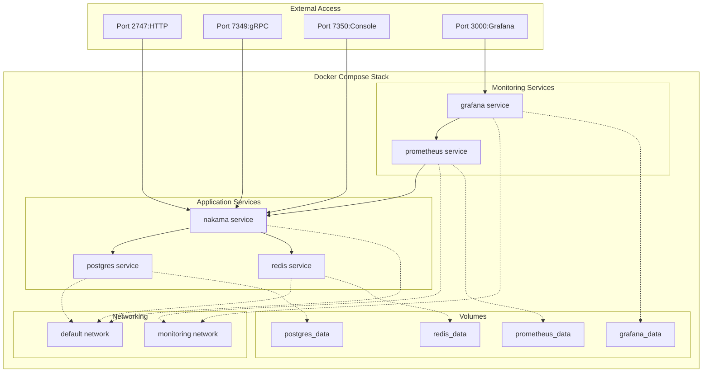

## Kubernetes Deployment

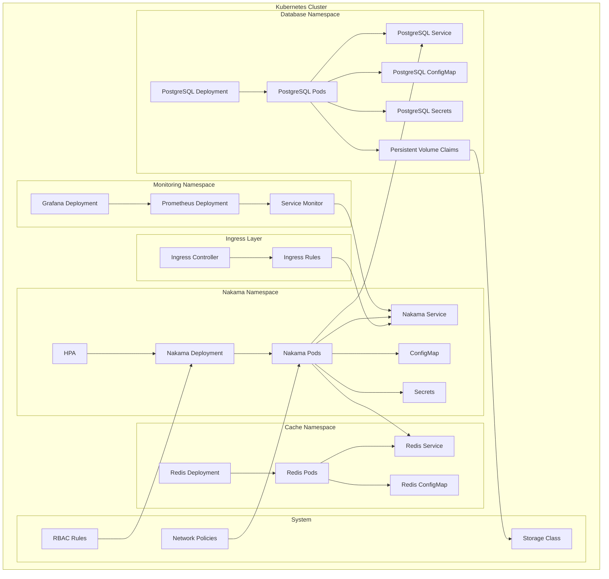

## AWS Cloud Deployment

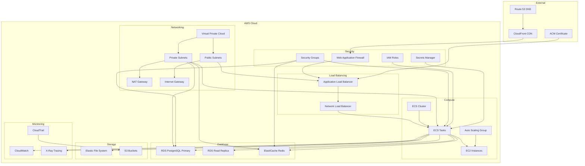

## Google Cloud Deployment

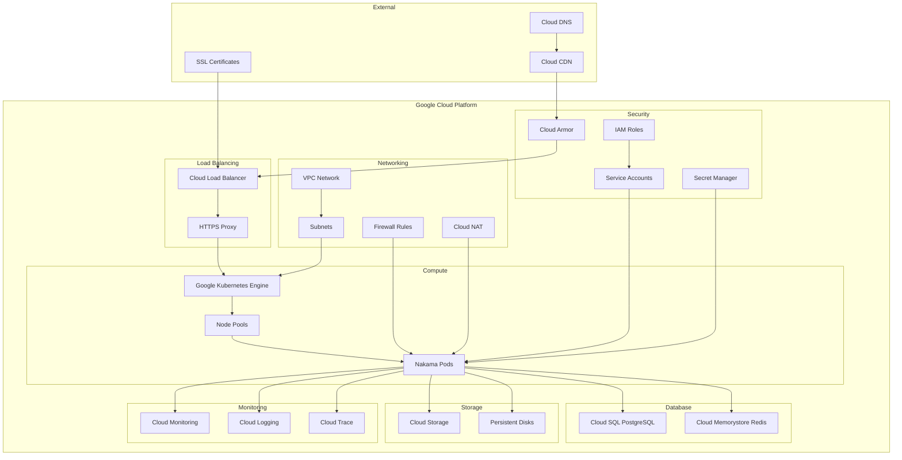

## Auto-Scaling Configuration

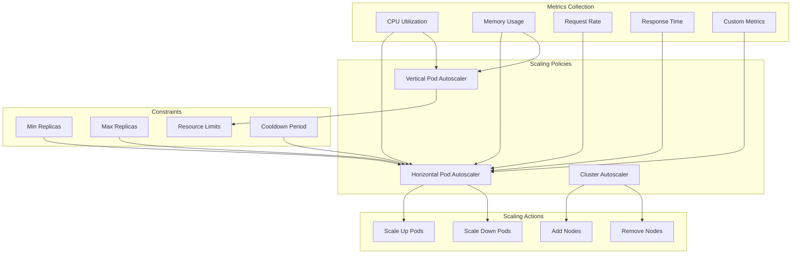

## Database Scaling Patterns

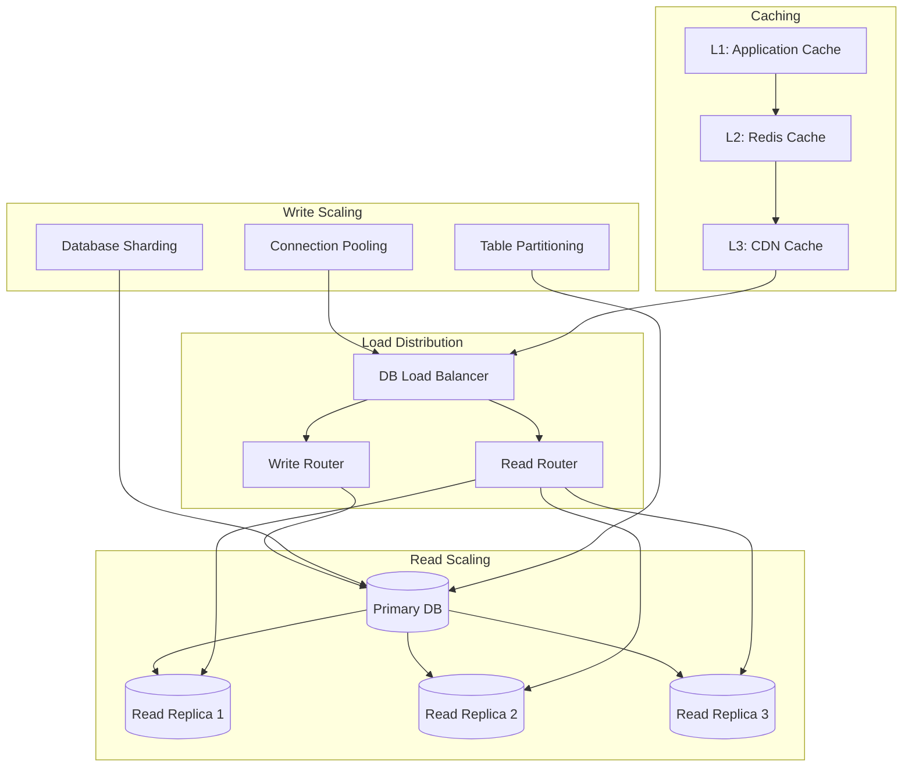

## Disaster Recovery

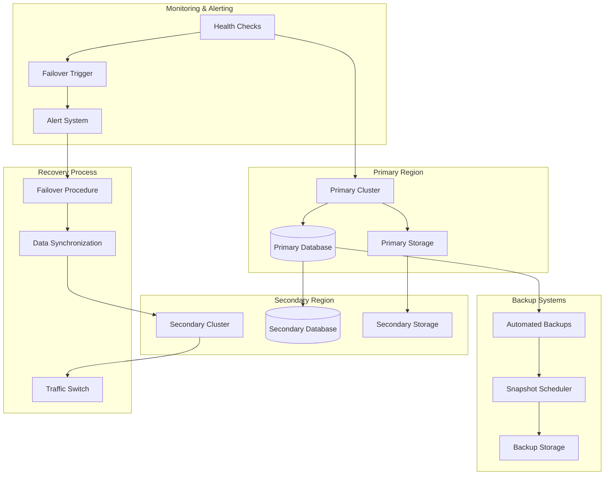

## Performance Optimization

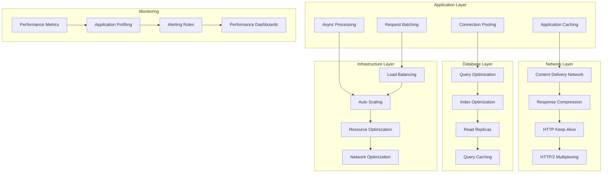

## Security Architecture

```mermaid
graph TB
    subgraph "Network Security"
        WAF[Web Application Firewall]
        DDoSProtection[DDoS Protection]
        TLSTermination[TLS Termination]
        VPN[VPN Access]
    end

    subgraph "Application Security"
        Authentication[Multi-factor Authentication]
        Authorization[Role-based Access]
        InputValidation[Input Validation]
        SessionManagement[Session Management]
    end

    subgraph "Data Security"
        EncryptionAtRest[Encryption at Rest]
        EncryptionInTransit[Encryption in Transit]
        KeyManagement[Key Management]
        DataMasking[Data Masking]
    end

    subgraph "Infrastructure Security"
        NetworkSegmentation[Network Segmentation]
        SecurityGroups[Security Groups]
        Compliance[Compliance Monitoring]
        VulnerabilityScanning[Vulnerability Scanning]
    end

    subgraph "Monitoring & Auditing"
        SecurityLogs[Security Logs]
        AuditTrails[Audit Trails]
        ThreatDetection[Threat Detection]
        IncidentResponse[Incident Response]
    end

    WAF --> DDoSProtection
    DDoSProtection --> TLSTermination
    TLSTermination --> VPN

    Authentication --> Authorization
    Authorization --> InputValidation
    InputValidation --> SessionManagement

    EncryptionAtRest --> EncryptionInTransit
    EncryptionInTransit --> KeyManagement
    KeyManagement --> DataMasking

    NetworkSegmentation --> SecurityGroups
    SecurityGroups --> Compliance
    Compliance --> VulnerabilityScanning

    SecurityLogs --> AuditTrails
    AuditTrails --> ThreatDetection
    ThreatDetection --> IncidentResponse
```

This deployment architecture provides multiple options for deploying Nakama based on your specific requirements, from simple single-node setups to enterprise-grade distributed deployments with full redundancy, monitoring, and security features.