# Nakama Developer Guide - Architecture Documentation

This guide provides a comprehensive overview of the Nakama game server architecture for developers, system architects, and DevOps engineers.

## Quick Navigation

| Document | Description | Use Case |
|----------|-------------|----------|
| [📋 Main Architecture](ARCHITECTURE.md) | Complete system overview with all diagrams | Understanding the overall system |
| [🗃️ Database Architecture](DATABASE_ARCHITECTURE.md) | Database schema and data models | Database design and optimization |
| [⚙️ Runtime Architecture](RUNTIME_ARCHITECTURE.md) | Plugin system and extensibility | Building custom game logic |
| [🔌 API Architecture](API_ARCHITECTURE.md) | HTTP/gRPC/WebSocket APIs | Client integration |
| [🚀 Deployment Architecture](DEPLOYMENT_ARCHITECTURE.md) | Production deployment patterns | Infrastructure and DevOps |

## Architecture Overview Diagram

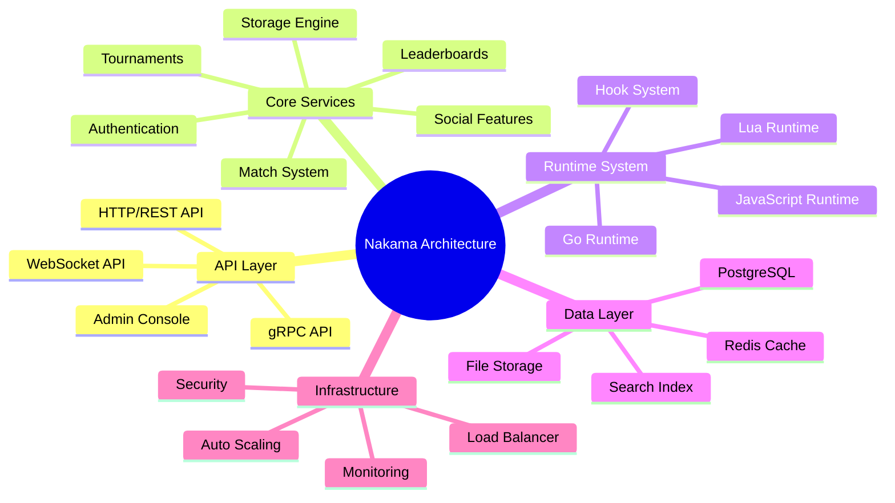

## Getting Started with Architecture

### 1. Understanding the Core Components

Start with the [main architecture document](ARCHITECTURE.md) to understand:
- System overview and component relationships
- High-level data flow
- Core architectural patterns

### 2. Database and Data Design

Review the [database architecture](DATABASE_ARCHITECTURE.md) for:
- Entity relationship diagrams
- Data access patterns
- Performance optimization strategies

### 3. Extending Functionality

Explore the [runtime architecture](RUNTIME_ARCHITECTURE.md) to learn:
- Plugin development patterns
- Hook system usage
- Runtime environment details

### 4. Client Integration

Study the [API architecture](API_ARCHITECTURE.md) for:
- API endpoint documentation
- Request/response patterns
- Real-time communication flows

### 5. Production Deployment

Reference the [deployment architecture](DEPLOYMENT_ARCHITECTURE.md) for:
- Infrastructure patterns
- Scaling strategies
- Security considerations

## Key Architectural Principles

### 1. Modularity
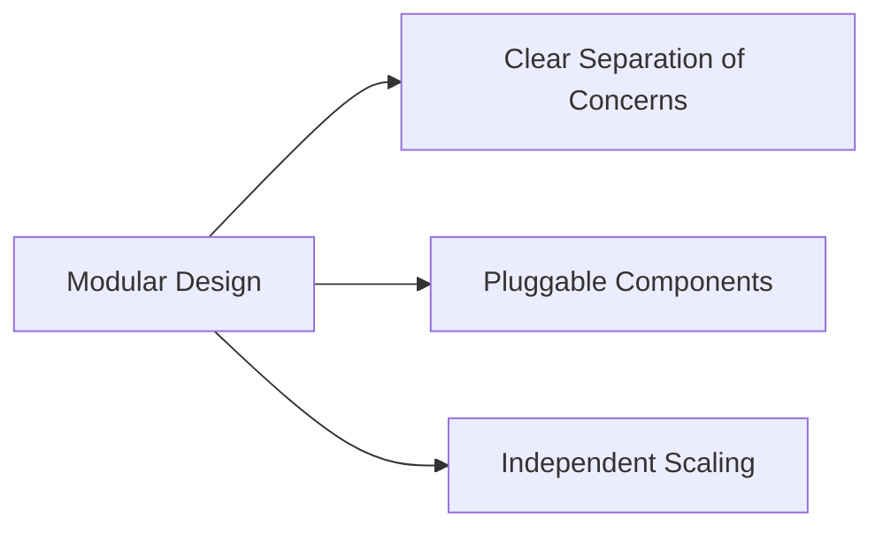

### 2. Scalability
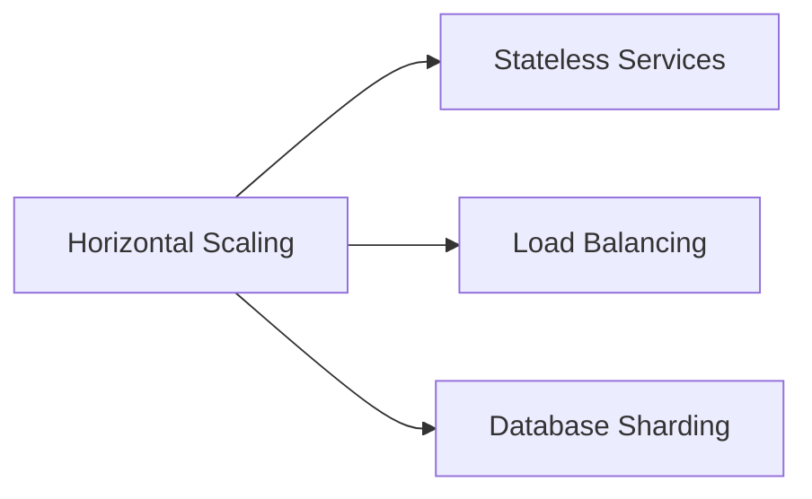

### 3. Extensibility
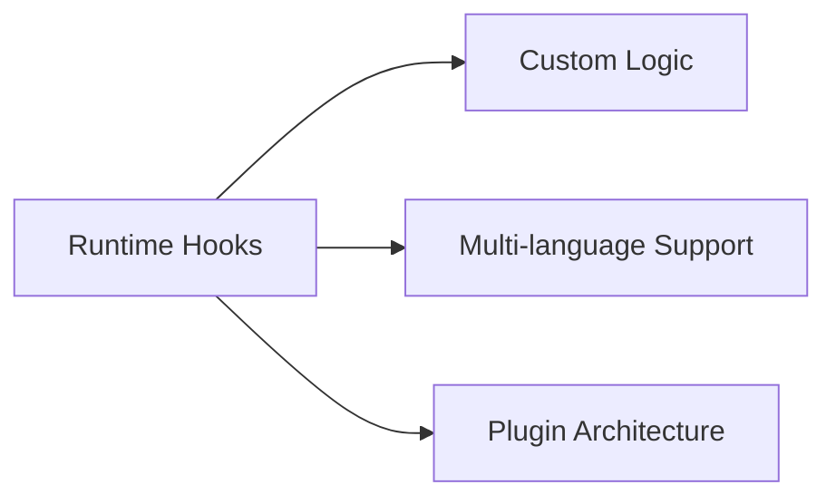

### 4. Performance
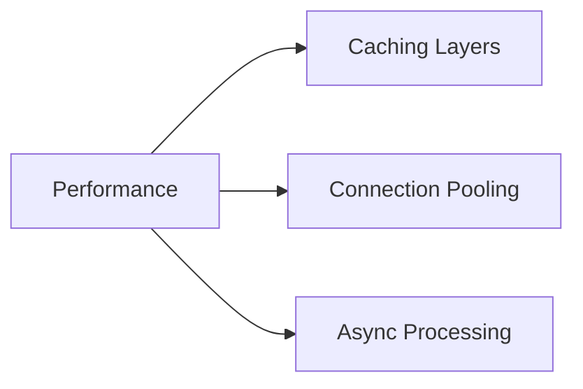

## Common Architecture Patterns

### 1. Request Flow Pattern
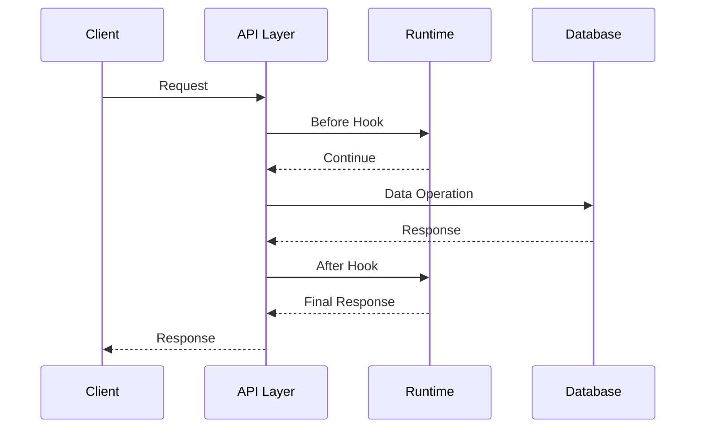

### 2. Event-Driven Pattern
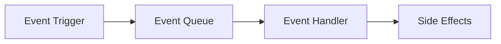

### 3. Plugin Pattern
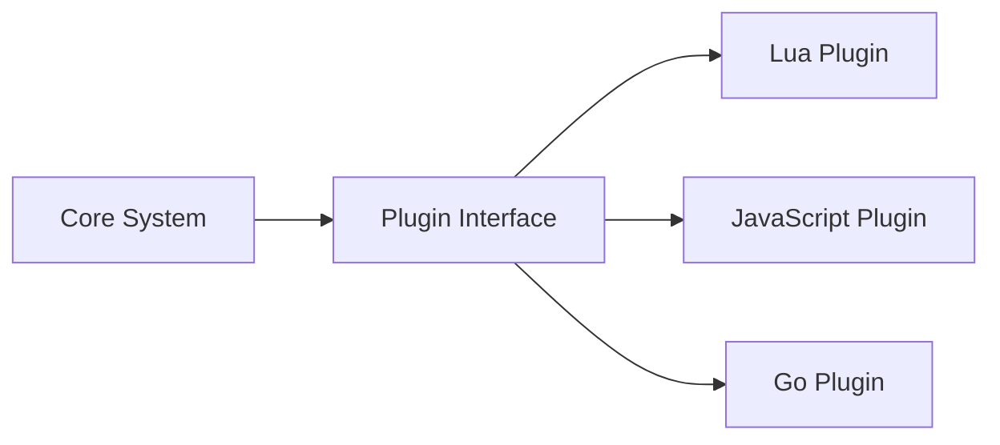

## Performance Characteristics

### Throughput Metrics
- **HTTP API**: 10,000+ requests/second per node
- **WebSocket**: 10,000+ concurrent connections per node
- **Database**: Optimized for high read/write ratios
- **Memory Usage**: Efficient pooling and garbage collection

### Latency Targets
- **API Response**: < 10ms (95th percentile)
- **Database Queries**: < 5ms (average)
- **Cache Access**: < 1ms (average)
- **Real-time Messages**: < 50ms end-to-end

## Security Architecture

### Authentication Flow
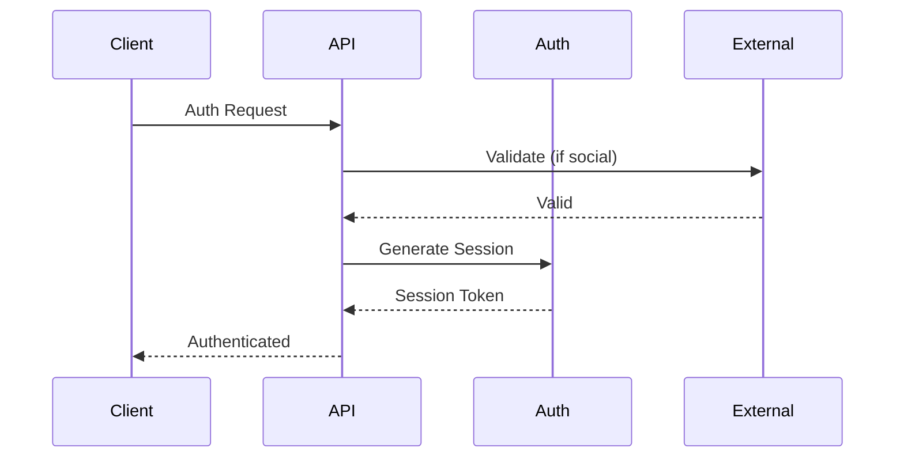

### Authorization Model
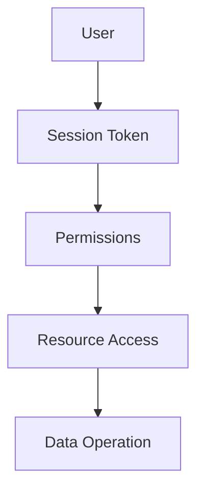

## Monitoring and Observability

### Metrics Collection
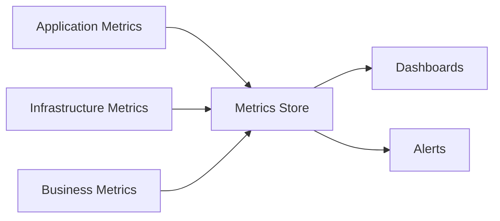

### Health Checks
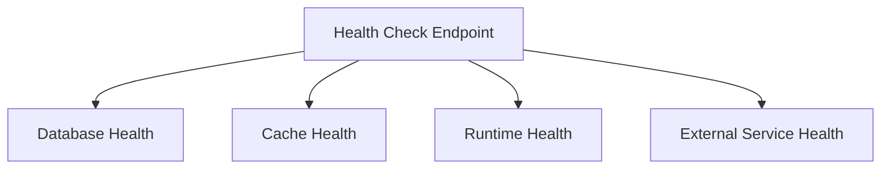

## Troubleshooting Guide

### Common Issues and Solutions

| Issue | Component | Solution Reference |
|-------|-----------|-------------------|
| High API Latency | API Layer | [API Architecture - Performance](API_ARCHITECTURE.md#performance-optimization) |
| Database Slow Queries | Database | [Database Architecture - Optimization](DATABASE_ARCHITECTURE.md#performance-optimization) |
| Memory Leaks | Runtime | [Runtime Architecture - Memory Management](RUNTIME_ARCHITECTURE.md#memory-management) |
| Connection Issues | Infrastructure | [Deployment Architecture - Networking](DEPLOYMENT_ARCHITECTURE.md#networking) |

### Debug Flow
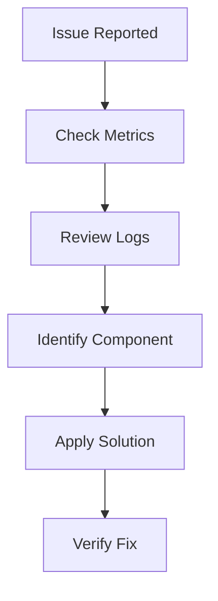

## Development Workflow

### Local Development
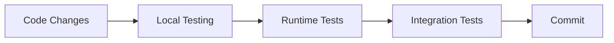

### Deployment Pipeline
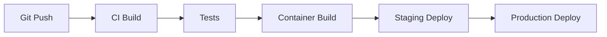

## Best Practices

### Code Organization
- Follow the modular architecture patterns
- Implement proper error handling
- Use appropriate caching strategies
- Design for horizontal scaling

### Database Design
- Normalize data appropriately
- Use proper indexing strategies
- Implement connection pooling
- Plan for data archival

### Runtime Development
- Keep functions lightweight
- Handle errors gracefully
- Use appropriate timeouts
- Monitor resource usage

### Deployment
- Use infrastructure as code
- Implement proper monitoring
- Plan for disaster recovery
- Follow security best practices

## Contributing to Architecture

### Documentation Updates
1. Review existing documentation
2. Identify gaps or outdated information
3. Submit pull requests with improvements
4. Include relevant diagrams

### Architecture Decisions
1. Discuss significant changes in GitHub issues
2. Document architectural decision records (ADRs)
3. Consider backward compatibility
4. Update relevant documentation

## Additional Resources

- [Nakama Documentation](https://heroiclabs.com/docs)
- [Community Forum](https://forum.heroiclabs.com)
- [GitHub Repository](https://github.com/heroiclabs/nakama)
- [Docker Hub](https://hub.docker.com/r/heroiclabs/nakama)

---

*This documentation is maintained by the Nakama development team and community contributors. For questions or suggestions, please open an issue on GitHub.*