# Nakama Runtime Architecture

This document details the runtime architecture of Nakama, focusing on the plugin system and extensibility features.

## Runtime System Overview

Nakama supports three runtime environments for extending server functionality:

1. **Lua Runtime** - Lightweight scripting with LuaJIT
2. **JavaScript Runtime** - V8-powered JavaScript execution
3. **Go Runtime** - Native Go plugins compiled as shared objects

## Runtime Architecture

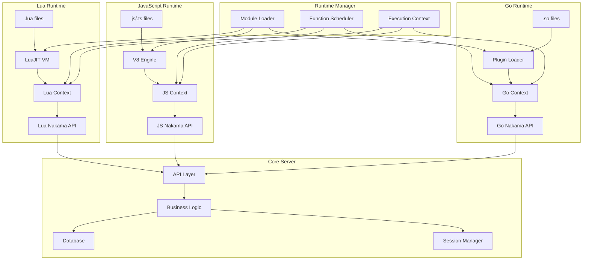

## Hook System

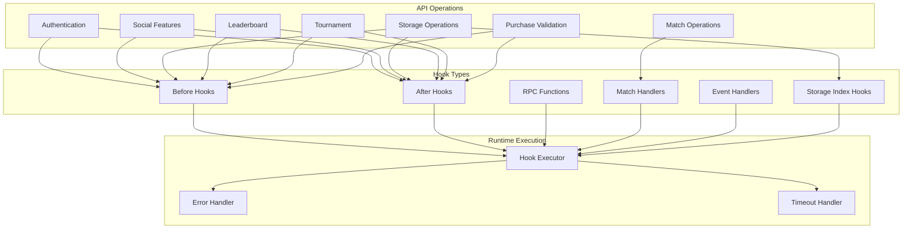

## Module Loading Sequence

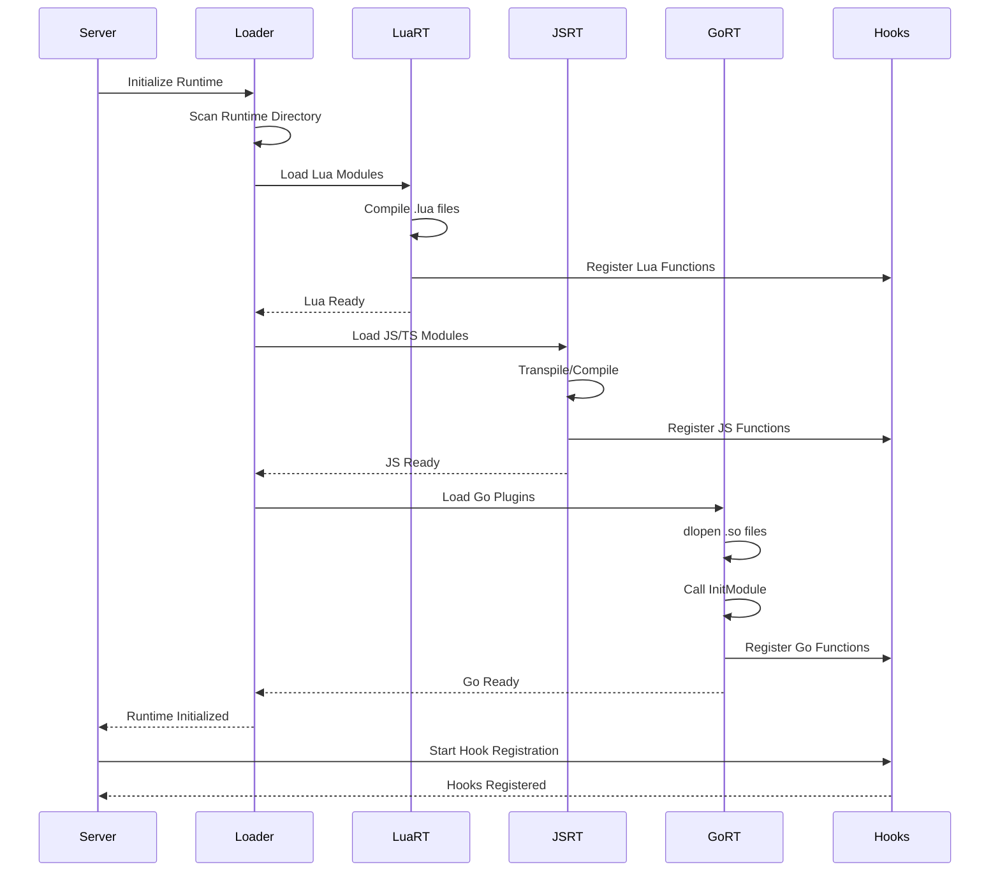

## Function Execution Flow

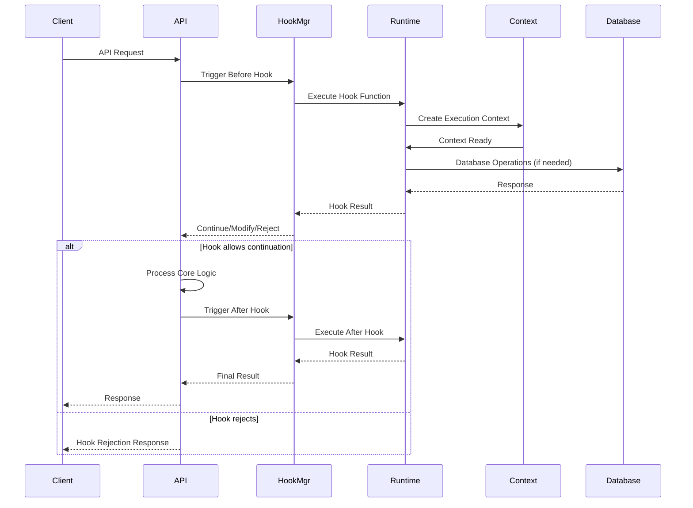

## Runtime Context and API

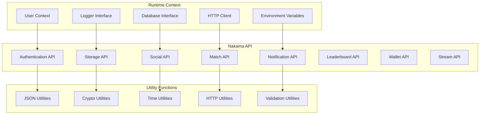

## Error Handling and Timeouts

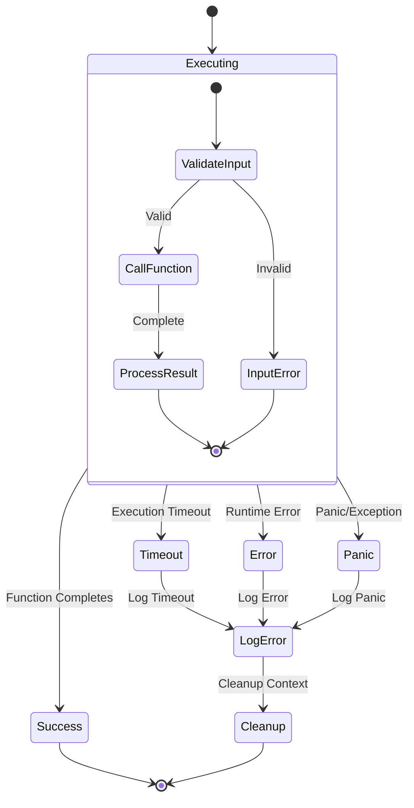

## Runtime Configuration

```mermaid
graph TB
    subgraph "Runtime Config"
        RuntimePath[Runtime Path]
        HTTPKey[HTTP Key]
        Environment[Environment]
        ReadOnlyGlobals[Read Only Globals]
        CallStackSize[Call Stack Size]
        MinCount[Min Pool Size]
        MaxCount[Max Pool Size]
        JSEntrypoint[JS Entrypoint]
        EventQueue[Event Queue Size]
    end

    subgraph "Runtime Pools"
        LuaPool[Lua VM Pool]
        JSPool[JS Context Pool]
        GoPool[Go Plugin Pool]
    end

    subgraph "Security Settings"
        Sandbox[Sandbox Mode]
        AllowedModules[Allowed Modules]
        TimeoutSettings[Timeout Settings]
        MemoryLimits[Memory Limits]
    end

    RuntimePath --> LuaPool
    RuntimePath --> JSPool
    RuntimePath --> GoPool

    MinCount --> LuaPool
    MaxCount --> LuaPool
    MinCount --> JSPool
    MaxCount --> JSPool

    JSEntrypoint --> JSPool
    EventQueue --> LuaPool
    EventQueue --> JSPool

    Sandbox --> LuaPool
    Sandbox --> JSPool
    AllowedModules --> LuaPool
    AllowedModules --> JSPool
    TimeoutSettings --> LuaPool
    TimeoutSettings --> JSPool
    MemoryLimits --> LuaPool
    MemoryLimits --> JSPool
```

## Module Types and Registration

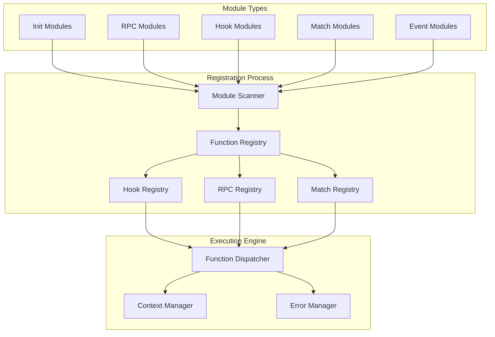

## Performance Considerations

### VM Pool Management

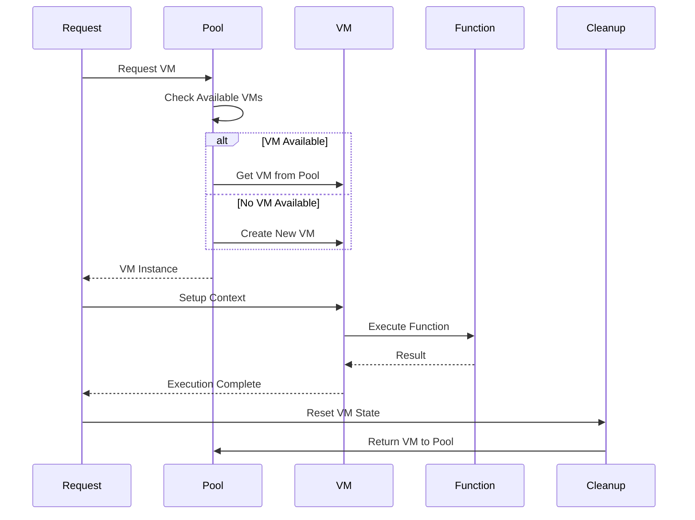

### Memory Management

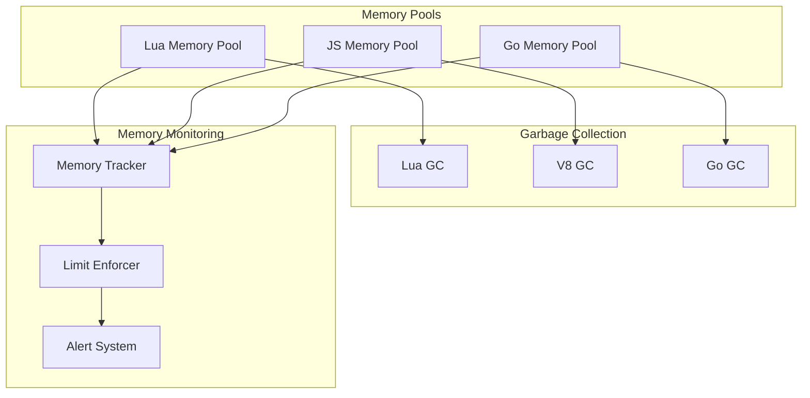

## Debugging and Monitoring

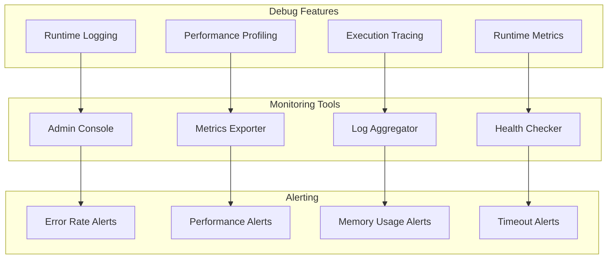

This runtime architecture enables powerful extensibility while maintaining performance, security, and reliability. The multi-language support allows developers to choose the best tool for their specific use cases while providing a consistent API across all runtime environments.